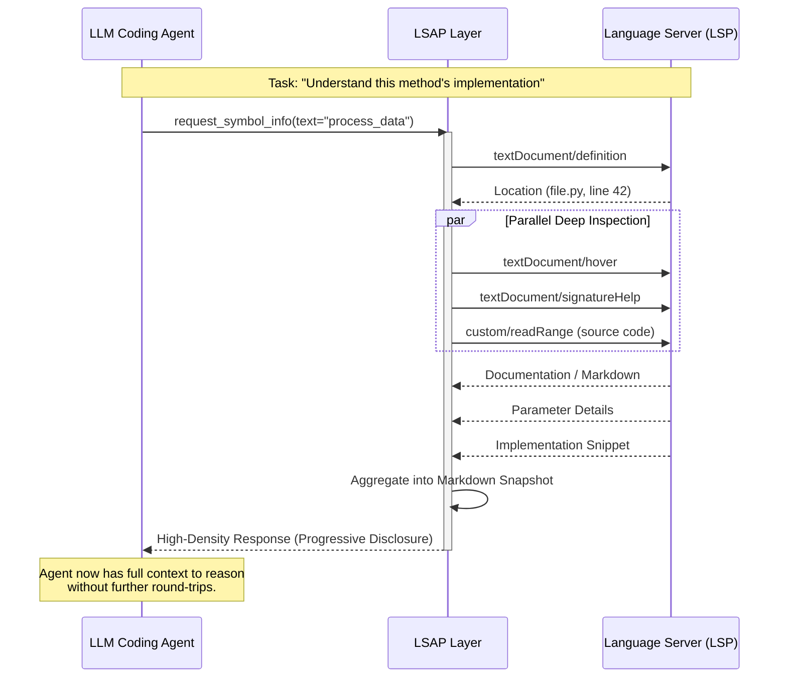

# LSAP: Language Server Agent Protocol

[](LICENSE)
[]()

**LSAP** (Language Server Agent Protocol) is a semantic abstraction layer that transforms **Language Server Protocol (LSP)** into an agent-native cognitive framework.

While traditional LSP was optimized for human-centric, incremental UI updates, LSAP is engineered for the **Progressive Disclosure** of codebase intelligence to LLM Agents. It provides the structured, high-fidelity context necessary for agents to reason about, navigate, and modify complex software systems autonomously.

---

## 🧠 The Core Philosophy: Agent-Native Progressive Disclosure

The fundamental challenge for Coding Agents is not the lack of information, but the **noise-to-signal ratio**. Standard LSP is often too granular, leading to fragmented context and reasoning failures. LSAP solves this by:

- **Strategic Disclosure**: Dynamically revealing code structure and semantics based on the agent's current task state, ensuring it has _exactly_ what it needs to reason, and nothing more.
- **Semantic Aggregation**: Collapsing multiple low-level LSP round-trips into high-density "Cognitive Snapshots" (e.g., merging definition, signature help, and implementation into a single atomic context).
- **Markdown-First Reasoning**: Serving information in structured Markdown templates that leverage the LLM's pre-trained ability to parse documentation, allowing the agent to "read" the codebase rather than just processing tokens.
- **Contextual Anchoring**: Providing robust "Locating" mechanisms that allow agents to resolve ambiguous intent into precise architectural coordinates.

---

## 🔄 Cognitive Flow: Strategic Aggregation

LSAP acts as a sophisticated orchestrator, converting high-level agent intents into coordinated language server operations:



---

## 🛠 Case Studies: Agent-Native Design

LSAP's superiority over standard LSP for coding agents is best demonstrated through its "intent-to-action" mapping:

### 1. 📍 Locate: The "Universal Link" for Cognitive Anchoring

In standard LSP, every request (hover, definition, references) requires a precise `(line, character)` coordinate. However, an LLM agent's "mental model" of the code is often based on **textual evidence** or **symbolic paths**.

- **The LSP Way**: The agent must first read the entire file, use its own reasoning to find the line/column of a snippet, and then send a request. This is high-latency, token-expensive, and fragile (a single space change breaks the coordinate).
- **The LSAP Way**: LSAP introduces a **Unified Locating Layer**. Any request can be anchored using:
  - **`LocateText`**: Find a position by searching for a code snippet within a file or range.
  - **`LocateSymbol`**: Resolve a hierarchical path (e.g., `["User", "Profile", "save"]`) to its exact implementation.
  - **Heuristic Resolution**: LSAP uses fuzzy matching and AST context to ensure that if an agent says _"find the `logger` call near the end of the `try` block"_, it resolves to the correct node regardless of formatting changes.

This makes `Locate` the universal entry point—the agent no longer needs to worry about "where" things are in terms of raw coordinates, focusing instead on "what" it wants to inspect.

### 2. 📞 Call Hierarchy: From Stateful Items to Relational Graphs

LSP's call hierarchy is a stateful, multi-step process: `prepare` -> `incoming` (for each item). Managing these handles across a long-running agent session is complex.

- **The LSP Way**: The agent must manage `CallHierarchyItem` objects and make sequential calls to expand the tree, often losing context or getting stuck in state management.
- **The LSAP Way**: The agent makes a single `CallHierarchyRequest` specifying a `depth` (e.g., `depth=2`). LSAP recursively traverses the hierarchy and returns a **flattened relational graph** as a single Markdown snapshot. The agent immediately sees the broader architectural impact of a change without needing to manually "click through" nodes.

---

## 🛠 Core Capabilities

The LSAP specification categorizes capabilities into functional layers, facilitating progressive disclosure of codebase intelligence:

### 🌐 Discovery & Resolution

| Capability              | Description                                                                |
| :---------------------- | :------------------------------------------------------------------------- |
| 🌐 **Workspace Search** | Global, paginated search for symbols across the entire project.            |
| 📍 **Locate**           | Resolve ambiguous text snippets or symbol paths to exact file coordinates. |

### 🔍 Deep Inspection

| Capability            | Description                                                                       |
| :-------------------- | :-------------------------------------------------------------------------------- |
| 🔍 **Symbol Info**    | High-density retrieval of documentation, signatures, and source code for symbols. |
| 🗂 **Symbol Outline** | Generate a hierarchical map (AST-lite) of all symbols within a file.              |
| 💡 **Inlay Hints**    | Augment source code with static types and runtime values for enhanced reasoning.  |

### 🔗 Relational Mapping

| Capability            | Description                                                          |
| :-------------------- | :------------------------------------------------------------------- |
| 🔗 **References**     | Trace all usages and call sites of a symbol project-wide.            |
| 🏗 **Implementation** | Discover concrete implementations of interfaces or abstract methods. |
| 📞 **Call Hierarchy** | Map incoming and outgoing function call relationships.               |
| 🌳 **Type Hierarchy** | Explore complex inheritance and class relationship trees.            |

### 🩺 Environmental Awareness

| Capability         | Description                                                               |
| :----------------- | :------------------------------------------------------------------------ |
| 🩺 **Diagnostics** | Real-time access to linting issues, syntax errors, and suggested fixes.   |
| 📝 **Rename**      | Predict and execute safe symbol renaming with project-wide diff analysis. |

---

## 🚀 Quick Start

LSAP provides a high-level API for agents to interact with codebases.

### Python

```python
from lsap.protocol.symbol import SymbolCapability
from lsap_schema.schema.symbol import SymbolRequest
from lsp_client.clients.pyright import PyrightClient

async with PyrightClient() as lsp_client:
    # Initialize the LSAP capability
    symbol_info = SymbolCapability(client=lsp_client)

    # Request high-density information about a symbol
    response = await symbol_info(SymbolRequest(
        locate={"file_path": "src/main.py", "text": "my_function"}
    ))

    if response:
        # LSAP responses include pre-rendered markdown for LLM consumption
        print(response.markdown)
```

## 📦 SDKs & Framework Integration

LSAP provides first-class SDKs for both Python and TypeScript, making it effortless to integrate into modern AI Agent frameworks (such as LangChain, AutoGPT, CrewAI, or custom solutions).

- **Python SDK**: High-performance, async-native implementation. Ideal for server-side agents and research environments.
- **TypeScript SDK**: Zod-based schema validation and type-safe utilities. Perfect for browser-based IDEs or Node.js agent runtimes.

These SDKs allow you to treat LSAP capabilities as standard "Tools" within your agent's reasoning loop, providing a consistent interface across different programming languages and LSP servers.

---

## 🏗 Project Architecture

LSAP is a cross-language protocol ecosystem:

- **`schema/`**: The source of truth. Formal protocol definitions and data models.
- **`python/`**: Reference implementation of the LSAP server and client, built on a production-ready async LSP client.
- **`typescript/`**: Zod-based schema definitions and utilities for TypeScript/Node.js agent environments.
- **`docs/schemas/`**: Detailed specifications for each protocol method and data model.

## 🛠 Protocol Integrity

LSAP is designed as a single-source-of-truth protocol. The core definitions are maintained in the `schema/` package and automatically propagated to other language implementations:

1. **Python**: Core definitions using Pydantic models.
2. **JSON Schema**: Exported from Python models for cross-language compatibility.
3. **TypeScript**: Zod schemas automatically generated from the JSON Schema definitions.

Run the codegen pipeline:

```bash
just codegen
```

## 📖 Protocol Specification

For detailed information on each capability, request/response models, and the complete data schema, please refer to our formal documentation:

- **[Full API Documentation](docs/schemas/README.md)**: A comprehensive guide to all LSAP methods.
- **[JSON Schema Definitions](schema/README.md)**: Formal machine-readable specifications.

### Individual Capability Specs:

- [Locate](docs/schemas/locate.md) | [Symbol](docs/schemas/symbol.md) | [Symbol Outline](docs/schemas/symbol_outline.md)
- [Definition](docs/schemas/definition.md) | [Call Hierarchy](docs/schemas/call_hierarchy.md) | [Type Hierarchy](docs/schemas/type_hierarchy.md)
- [References](docs/schemas/reference.md) | [Implementation](docs/schemas/implementation.md)
- [Workspace Search](docs/schemas/workspace.md) | [Diagnostics](docs/schemas/diagnostics.md)
- [Completion](docs/schemas/completion.md) | [Rename](docs/schemas/rename.md)
- [Inlay Hints & Inline Values](docs/schemas/inlay_hints.md)

---

## 🚀 Design Principles

1. **Cognitive Efficiency**: Maximize information density per token. Every byte returned to the agent should contribute to its reasoning process.
2. **Task-Oriented Granularity**: Provide information at the level of abstraction relevant to the agent's current goal (from high-level workspace maps to low-level implementation details).
3. **Deterministic Structure**: Strict schema adherence ensures the agent can rely on a consistent "mental model" of the codebase across different languages and environments.
4. **Agentic Autonomy**: Proactively provide the metadata (like pagination hints or related symbols) that empowers agents to explore the codebase without needing human intervention.

## 📜 License

This project is licensed under the MIT License - see the [LICENSE](LICENSE) file for details.

---

Built for the next generation of AI Software Engineers.
