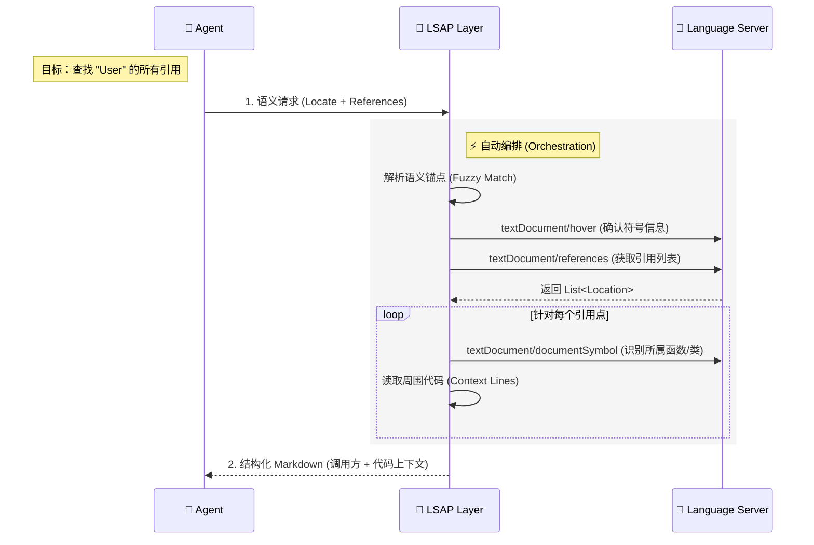

# LSAP: Language Server Agent Protocol

[](LICENSE)
[]()

**LSAP (Language Server Agent Protocol)** 是一个专为 Coding Agent 设计的 **Agent 原生 (Agent-Native)** 交互协议。

与传统的 LSP 不同，LSAP 并不是简单地将 LSP 暴露给 Agent，而是作为 **能力编排层 (Orchestration Layer)**，通过**组合 (Composing)** LSP 提供的原子能力，构建出符合 Agent 认知逻辑的高阶语义接口。

它让 Agent 从繁琐的"编辑器操作"中解放出来，专注于高层的"意图实现"，真正获得**仓库级代码分析与探索能力**。

## 核心理念：原子能力 vs. 认知能力

LSAP 的核心区别在于它如何定义"能力"。LSP 是为编辑器设计的，提供的是**原子 (Atomic)** 操作；而 LSAP 是为 Agent 设计的，提供的是**认知 (Cognitive)** 能力。

*   **LSP (编辑器视角 - 原子化)**:
    *   编辑器需要非常底层的指令：`textDocument/definition` (跳转)、`textDocument/hover` (悬停)、`textDocument/documentSymbol` (大纲)。
    *   **Agent 的困境**: Agent 如果直接使用 LSP，需要像脚本一样连续执行十几次交互（打开文件 -> 计算偏移量 -> 请求定义 -> 解析 URI -> 读取文件 -> 截取片段）才能获得一个有用的上下文。
*   **LSAP (Agent 视角 - 认知化)**:
    *   LSAP 将上述复杂的原子操作链封装为一个语义指令。
    *   **示例**: 当 Agent 请求 "查找 `User` 类的所有引用" 时，LSAP 会自动在后台执行符号定位、引用查找、上下文识别、代码读取等一系列 LSP 操作，最终直接返回一个包含所有调用方上下文的 **Markdown 报告**。



## 交互示例

LSAP 的交互设计完全遵循 **Markdown-First** 原则，输入表达意图，输出提供经过提炼的知识。

### 请求：语义化查找 (组合能力体现)

Agent 只需发出一个高层指令，无需关心底层的行列计算与文件读取：

```json
// Intent: Find all usages of 'format_date' to refactor it
{
  "locate": {
    "file_path": "src/utils.py",
    "find": "def format_date<HERE>" // 语义锚点
  },
  "mode": "references",
  "max_items": 10
}
```

### 响应：结构化知识

LSAP 聚合了 `references` (位置), `documentSymbol` (调用方上下文) 和 `read` (代码片段) 的结果：

````markdown
# References Found

Total references: 45 | Showing: 2

### `src/ui/header.py`:28

In `Header.render` (`Method`)

```python
formatted = format_date(user.last_login)
```

### `src/api/views.py`:42

In `UserDetail.get` (`Method`)

```python
return {"date": format_date(obj.created_at)}
```
````

## 项目结构

- [`docs/`](docs/): 协议核心定义与 Schema 文档。
- [`python/`](python/): Python SDK 参考实现。
- [`typescript/`](typescript/): TypeScript 类型定义与工具库。
- [`web/`](web/): 协议文档站点。

## License

[MIT](LICENSE)
