# LSAP: Language Server Agent Protocol

[](LICENSE)
[]()

**LSAP (Language Server Agent Protocol)** empowers Coding Agents with **Repository-Scale Intelligence** by transforming low-level LSP capabilities into high-level, **Agent-Native** cognitive tools.

Unlike traditional LSP, LSAP does not simply expose LSP to Agents. Instead, it serves as an **Orchestration Layer**, building high-level semantic interfaces that align with Agent cognitive logic by **Composing** the atomic capabilities provided by LSP.

It liberates Agents from tedious "editor operations," allowing them to focus on high-level "intent realization," thereby truly achieving **Repository-Scale Code Analysis and Exploration Capabilities**.

## Core Concept: Atomic Capabilities vs. Cognitive Capabilities

The core difference of LSAP lies in how it defines "capabilities." LSP is designed for editors, providing **Atomic** operations; whereas LSAP is designed for Agents, providing **Cognitive** capabilities.

*   **LSP (Editor Perspective - Atomic)**:
    *   Editors require very low-level instructions: `textDocument/definition` (jump), `textDocument/hover` (hover), `textDocument/documentSymbol` (outline).
    *   **The Agent's Dilemma**: If an Agent uses LSP directly, it needs to execute a dozen interactions sequentially like a script (open file -> calculate offset -> request definition -> parse URI -> read file -> extract snippet) just to get a useful context.
*   **LSAP (Agent Perspective - Cognitive)**:
    *   LSAP encapsulates the complex chain of atomic operations above into a single semantic instruction.
    *   **Example**: When an Agent requests "Find all references of the `User` class," LSAP automatically executes a series of LSP operations in the background—symbol localization, reference search, context identification, code reading—and finally returns a **Markdown Report** containing all caller contexts.

```mermaid
sequenceDiagram
    participant Agent as 🤖 Agent
    participant LSAP as 🧠 LSAP Layer
    participant LSP as 🔧 Language Server

    Note left of Agent: Goal: Find all references of "User"

    Agent->>LSAP: 1. Semantic Request (Locate + References)
    
    rect rgb(245, 245, 245)
        Note right of LSAP: ⚡️ Auto Orchestration
        LSAP->>LSAP: Parse Semantic Anchor (Fuzzy Match)
        LSAP->>LSP: textDocument/hover (Confirm Symbol Info)
        LSAP->>LSP: textDocument/references (Get Reference List)
        LSP-->>LSAP: Return List<Location>
        
        loop For each reference point
            LSAP->>LSP: textDocument/documentSymbol (Identify Function/Class)
            LSAP->>LSAP: Read Surrounding Code (Context Lines)
        end
    end
    
    LSAP-->>Agent: 2. Structured Markdown (Callers + Code Context)
```



## Interaction Example

LSAP's interaction design strictly follows the **Markdown-First** principle: input expresses intent, and output provides refined knowledge.

### Request: Semantic Search (Demonstrating Composed Capabilities)

The Agent only needs to issue a high-level command without worrying about underlying row/column calculations or file reading:

```jsonc
// Intent: Find all usages of 'format_date' to refactor it
{
  "locate": {
    "file_path": "src/utils.py",
    "find": "def format_date<HERE>" // Semantic Anchor
  },
  "mode": "references",
  "max_items": 10
}
```

### Response: Structured Knowledge

LSAP aggregates the results of `references` (locations), `documentSymbol` (caller context), and `read` (code snippets):

````markdown
# References Found

Total references: 45 | Showing: 2

### `src/ui/header.py`:28

In `Header.render` (`Method`)

```python
formatted = format_date(user.last_login)
```

### `src/api/views.py`:42

In `UserDetail.get` (`Method`)

```python
return {"date": format_date(obj.created_at)}
```
````

## I'm not convinced...

### "LSAP seems to just replicate LSP capabilities, what makes it special?"

This is a common initial reaction, but LSAP offers **far more** than simple replication of LSP protocol capabilities. Let's clarify this with concrete examples:

**The key distinction**: LSP provides **atomic** operations (like `textDocument/references`, `textDocument/definition`), while LSAP provides **composed cognitive capabilities** that are specifically designed for Agent understanding at the repository scale.

#### Example: Relation API - Tracing Call Chains

Consider the **[Relation API](docs/schemas/draft/relation.md)**: When an Agent wants to understand "How does function A ultimately reach function B?", using raw LSP would require:

1. Manual BFS/DFS implementation across multiple `callHierarchy/outgoingCalls` requests
2. Cycle detection to prevent infinite loops
3. Path reconstruction and ranking
4. Reading code context for each node in the path
5. Formatting results into understandable markdown

With LSAP's Relation API, the Agent simply expresses the intent: "Find paths from A to B", and receives a **structured markdown report** showing all call chains with complete context. This API doesn't exist in LSP at all—it's a **composition** of multiple LSP capabilities orchestrated intelligently.

#### Example: Unified Hierarchy API - Repository-Scale Navigation

The **[Unified Hierarchy API](docs/schemas/draft/hierarchy.md)** goes beyond LSP's `callHierarchy` and `typeHierarchy` by:

- **Unified interface**: Generic "incoming/outgoing" terminology that works for both call and type hierarchies
- **Graph representation**: Exposes full graph structure with nodes and edges, enabling complex analysis
- **Smart traversal**: Automatic cycle detection, depth control, and external reference filtering
- **Agent-ready format**: Flattened tree structure (`HierarchyItem[]`) ready for markdown rendering

Without LSAP, an Agent would need to:
- Understand the semantic differences between call and type hierarchies
- Implement separate traversal logic for each
- Handle cycles and recursion manually
- Parse and aggregate raw LSP responses
- Format complex graph data into readable output

#### Why This Matters for Agents

These high-level APIs transform repository exploration from a **tedious scripting task** into **semantic understanding**:

- **Cognitive Load**: Agents can focus on "What do I need to know?" rather than "How do I orchestrate 15 LSP calls?"
- **Reliability**: LSAP handles edge cases (cycles, external refs, large graphs) that Agents might miss
- **Performance**: Optimized orchestration reduces redundant LSP round-trips
- **Consistency**: Standardized markdown output format ensures reliable parsing

**Without LSAP**, every Agent would need to implement these orchestration patterns from scratch—leading to bugs, inconsistencies, and wasted tokens on implementation details rather than actual problem-solving.

#### The Roadmap: More Power Ahead

LSAP is not a static protocol. We are continuously designing and adding **Agent-Native** capabilities:

- **Architectural Analysis**: APIs for detecting patterns, anti-patterns, and architectural violations
- **Impact Analysis**: Understanding change propagation across the codebase
- **Semantic Code Search**: Beyond text matching, understanding code intent and behavior
- **Cross-Language Support**: Unified abstractions that work across language barriers

LSAP is building a **comprehensive toolkit** that empowers Agents with **Repository-Scale Intelligence**—something that raw LSP, designed for editors, simply cannot provide.

## Project Structure

- [`docs/`](docs/): Core protocol definitions and Schema documentation.
- [`python/`](python/): Python SDK reference implementation.
- [`typescript/`](typescript/): TypeScript type definitions and utility library.
- [`web/`](web/): Protocol documentation site.

## License

[MIT](LICENSE)
