# LSAP: Language Server Agent Protocol

[](LICENSE)
[]()

**LSAP (Language Server Agent Protocol)** empowers Coding Agents with **Repository-Scale Intelligence** by transforming low-level LSP capabilities into high-level, **Agent-Native** cognitive tools.

Unlike traditional LSP, LSAP does not simply expose LSP to Agents. Instead, it serves as an **Orchestration Layer**, building high-level semantic interfaces that align with Agent cognitive logic by **Composing** the atomic capabilities provided by LSP.

It liberates Agents from tedious "editor operations," allowing them to focus on high-level "intent realization," thereby truly achieving **Repository-Scale Code Analysis and Exploration Capabilities**.

## Core Concept: Atomic Capabilities vs. Cognitive Capabilities

The core difference of LSAP lies in how it defines "capabilities." LSP is designed for editors, providing **Atomic** operations; whereas LSAP is designed for Agents, providing **Cognitive** capabilities.

*   **LSP (Editor Perspective - Atomic)**:
    *   Editors require very low-level instructions: `textDocument/definition` (jump), `textDocument/hover` (hover), `textDocument/documentSymbol` (outline).
    *   **The Agent's Dilemma**: If an Agent uses LSP directly, it needs to execute a dozen interactions sequentially like a script (open file -> calculate offset -> request definition -> parse URI -> read file -> extract snippet) just to get a useful context.
*   **LSAP (Agent Perspective - Cognitive)**:
    *   LSAP encapsulates the complex chain of atomic operations above into a single semantic instruction.
    *   **Example**: When an Agent requests "Find all references of the `User` class," LSAP automatically executes a series of LSP operations in the background—symbol localization, reference search, context identification, code reading—and finally returns a **Markdown Report** containing all caller contexts.

```mermaid
sequenceDiagram
    participant Agent as 🤖 Agent
    participant LSAP as 🧠 LSAP Layer
    participant LSP as 🔧 Language Server

    Note left of Agent: Goal: Find all references of "User"

    Agent->>LSAP: 1. Semantic Request (Locate + References)
    
    rect rgb(245, 245, 245)
        Note right of LSAP: ⚡️ Auto Orchestration
        LSAP->>LSAP: Parse Semantic Anchor (Fuzzy Match)
        LSAP->>LSP: textDocument/hover (Confirm Symbol Info)
        LSAP->>LSP: textDocument/references (Get Reference List)
        LSP-->>LSAP: Return List<Location>
        
        loop For each reference point
            LSAP->>LSP: textDocument/documentSymbol (Identify Function/Class)
            LSAP->>LSAP: Read Surrounding Code (Context Lines)
        end
    end
    
    LSAP-->>Agent: 2. Structured Markdown (Callers + Code Context)
```



## Interaction Example

LSAP's interaction design strictly follows the **Markdown-First** principle: input expresses intent, and output provides refined knowledge.

### Request: Semantic Search (Demonstrating Composed Capabilities)

The Agent only needs to issue a high-level command without worrying about underlying row/column calculations or file reading:

```jsonc
// Intent: Find all usages of 'format_date' to refactor it
{
  "locate": {
    "file_path": "src/utils.py",
    "find": "def format_date<HERE>" // Semantic Anchor
  },
  "mode": "references",
  "max_items": 10
}
```

### Response: Structured Knowledge

LSAP aggregates the results of `references` (locations), `documentSymbol` (caller context), and `read` (code snippets):

````markdown
# References Found

Total references: 45 | Showing: 2

### `src/ui/header.py`:28

In `Header.render` (`Method`)

```python
formatted = format_date(user.last_login)
```

### `src/api/views.py`:42

In `UserDetail.get` (`Method`)

```python
return {"date": format_date(obj.created_at)}
```
````

## I'm Not Convinced...

### "LSAP Just Replicates LSP—What's Special?"

**The Key Distinction**: LSP provides **atomic operations** (like `textDocument/references`), while LSAP provides **composed cognitive capabilities** designed for Agents.

Take the **[Relation API](docs/schemas/draft/relation.md)**: Finding all call paths from function A to B requires manually orchestrating multiple LSP calls—BFS traversal, cycle detection, path reconstruction, and markdown formatting. LSAP does this in one request, returning a structured report.

Similarly, the **[Unified Hierarchy API](docs/schemas/draft/hierarchy.md)** goes beyond `callHierarchy`/`typeHierarchy` with unified graph representation, automatic cycle handling, and agent-ready output—capabilities that don't exist in raw LSP.

**Why It Matters**: Without LSAP, every Agent reimplements these patterns, wasting tokens on orchestration instead of problem-solving. LSAP is continuously evolving with more **Agent-Native** capabilities like architectural analysis, impact analysis, and semantic search—building a comprehensive toolkit for **Repository-Scale Intelligence**.

### "Why Not Just Use Existing Tools?"

Existing tools serve different purposes: GitHub Copilot excels at code completion, tree-sitter at parsing. LSAP doesn't replace these—it **orchestrates** them. Think of LSAP as the "brain" that coordinates LSP (the eyes) to give Agents repository-wide understanding, not just local code snippets.

### "This Adds Complexity"

LSAP **removes** complexity for Agent developers. The alternative is each Agent implementing custom LSP orchestration logic—multiplying complexity across every Agent project. LSAP centralizes this once, providing a battle-tested, optimized layer.

### "What About LSP Quality Variations?"

LSAP gracefully degrades. If a language server has limited capabilities, LSAP returns partial results with clear indicators. The **Markdown-First** design ensures Agents always get parseable output, even when underlying LSP support is incomplete.

## Project Structure

- [`docs/`](docs/): Core protocol definitions and Schema documentation.
- [`python/`](python/): Python SDK reference implementation.
- [`typescript/`](typescript/): TypeScript type definitions and utility library.
- [`web/`](web/): Protocol documentation site.

## License

[MIT](LICENSE)
